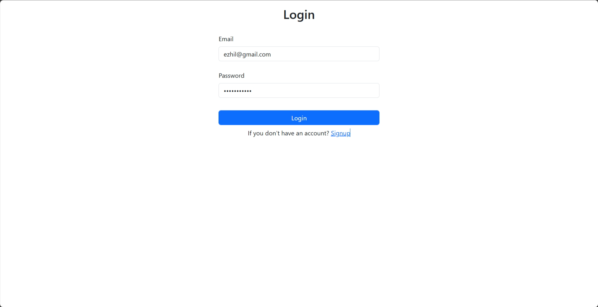
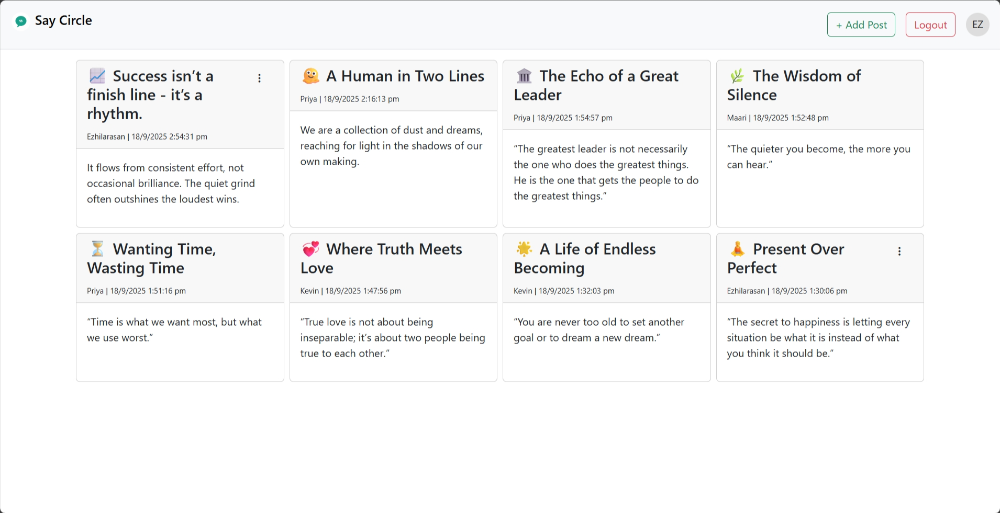
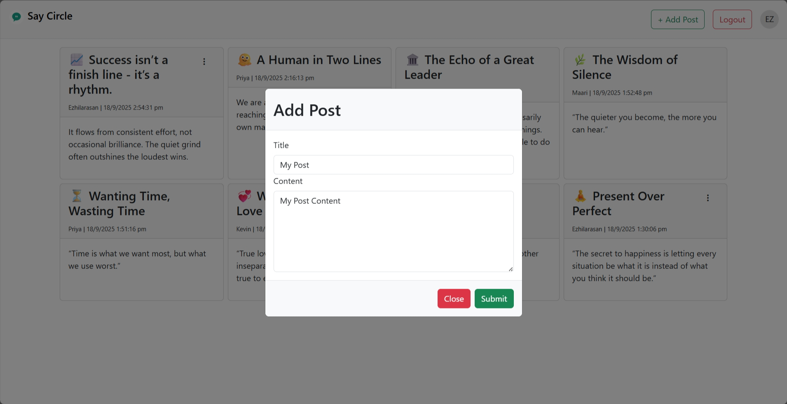
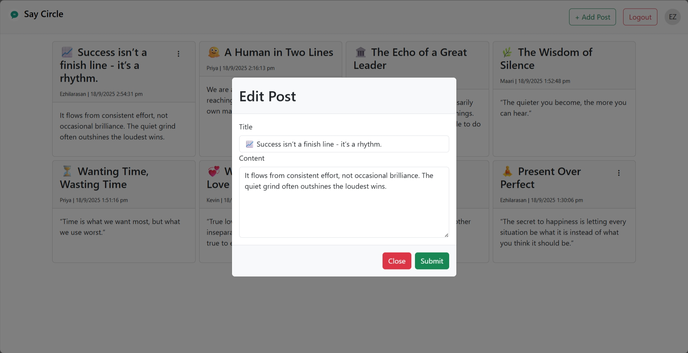

# 💬 Say Circle - Social Quotes App

Say Circle is a simple and modern **social media web application** that allows users to **create accounts, log in, and share their thoughts** with a title and content. Users can view posts from others, as well as edit or delete their own posts. The app is designed for easy sharing and interaction in a clean, responsive interface.

---

## 🚀 Features

- **User Registration & Login**: Secure JWT-based authentication.
- **Create & Manage Posts**: Share thoughts with a title and content, edit or delete your own posts.
- **View Community Posts**: Browse posts from all users.
- **Responsive UI**: Built with Bootstrap for mobile and desktop.
- **RESTful API**: Clean backend endpoints for all core actions.

---

## 🛠️ Tech Stack

- **Backend**: Python, Flask, REST API
- **Database**: SQLite with SQLAlchemy ORM
- **Frontend**: HTML, CSS, Bootstrap, JavaScript, Axios
- **Authentication**: JWT (JSON Web Tokens)

---

## ⚡ Getting Started

1. **Clone the repository:**
   ```bash
   git clone https://github.com/m-ezhil/Say-Circle.git
   cd say-circle
   ```

2. **Set up a virtual environment:**
   ```bash
   python -m venv venv
   # Activate:
   # On Mac/Linux:
   source venv/bin/activate
   # On Windows:
   venv\Scripts\activate
   ```

3. **Install dependencies:**
   ```bash
   pip install -r requirements.txt
   ```

4. **Run the app:**
   ```bash
   python app.py
   ```

5. **Open in your browser:**
   ```
   http://127.0.0.1:5050
   ```

---

## 📂 Project Structure

- `app.py` — Main Flask application entry point
- `models/` — SQLAlchemy models for users and posts
- `templates/` — HTML templates (Jinja2)
- `static/` — CSS, JS, and images
- `requirements.txt` — Python dependencies

---

## 🎨 UI Screenshots






---

## 📢 Contributing

Pull requests and issues are welcome! Please open an issue to discuss any major changes.

---

## 📝 License

This project is licensed under
